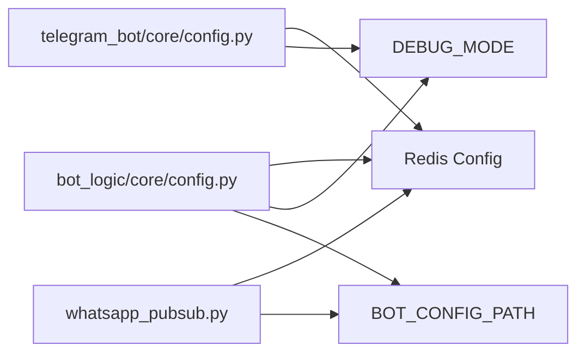
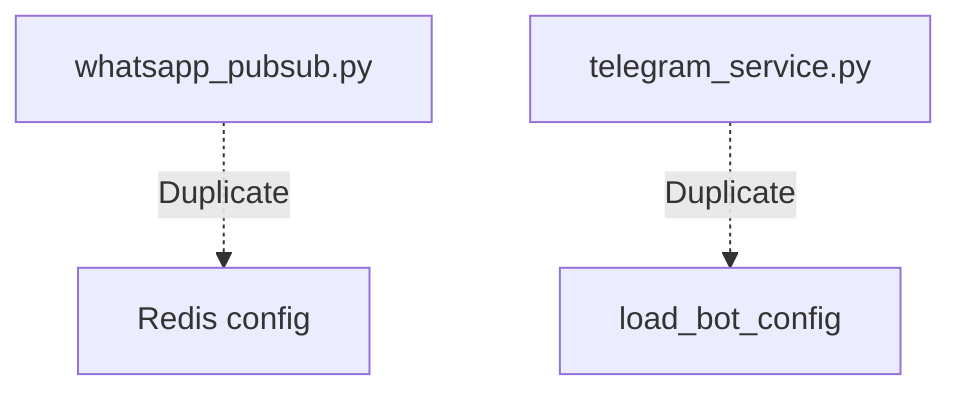
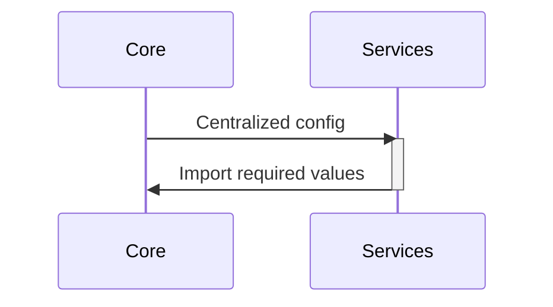
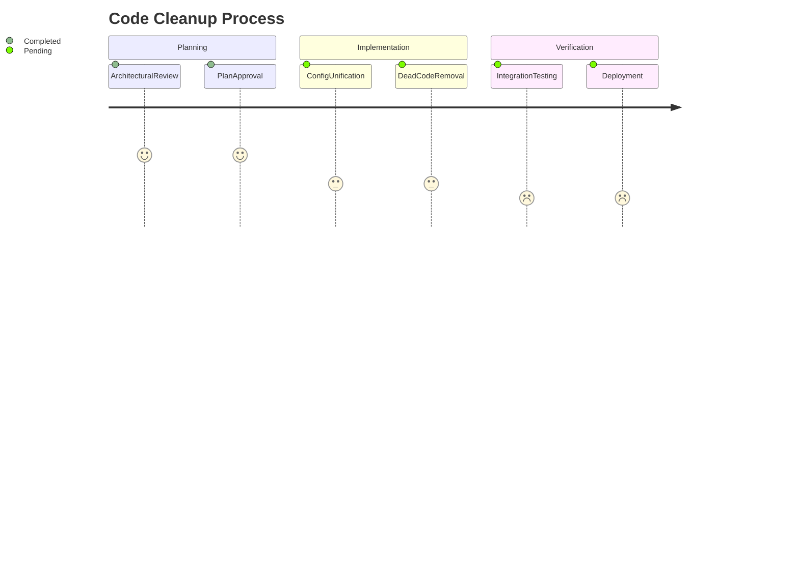

# Code Cleanup Plan

## Identified Issues

### 1. Configuration Duplication

### 2. Unused Code Elements
- `DEBUG_MODE` only affects logging levels
- `REDIS_TIMEOUT` only used in connection tests
- Duplicate `load_bot_config()` implementations

### 3. Dead Code Patterns

## Cleanup Implementation Steps

### 1. Configuration Unification

Files to modify:
- `telegram_bot/core/config.py` - Remove Redis/Debug config
- `whatsapp_pubsub.py` - Import from core config
- `telegram_bot/services/telegram_service.py` - Use core load_bot_config

### 2. Code Removal Targets
| File | Lines to Remove | Estimated Reduction |
|------|-----------------|---------------------|
| `telegram_bot/core/config.py` | 16-24, 26-29 | 12 LOC |
| `whatsapp_pubsub.py` | 8-15, 89-93 | 18 LOC |
| `telegram_bot/services/telegram_service.py` | 12-25 | 14 LOC |

### 3. Implementation Notes
1. Preserve backward compatibility during transition
2. Update Dockerfiles to ensure environment variables match core config
3. Add deprecation warnings for old config paths

## Next Steps

