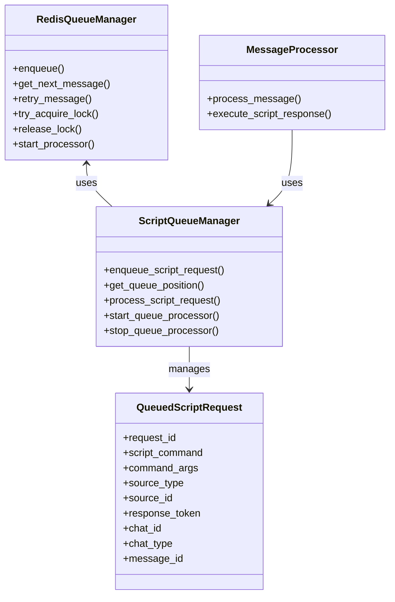
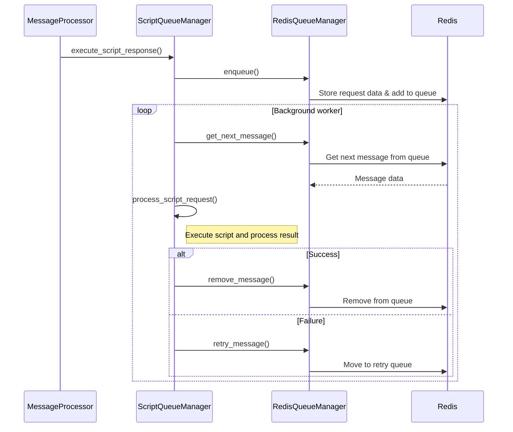

# Redis Queue Implementation Plan for Script Calling

## Overview

We'll create a Redis-based queue implementation for script calling similar to the one used for chat API. This will solve issues with the current implementation which lacks deduplication, proper locking, and retry capabilities.

## Core Components

1. **RedisQueueManager**: Reuse the existing generic Redis queue manager
2. **ScriptQueueManager**: New component specific to script execution
3. **QueuedScriptRequest**: Class to represent script execution requests

## Architecture



## Redis Key Structure

```
script_exec:
  ├── queue:main              # Sorted set for main message queue (score = timestamp)
  ├── queue:retry             # Sorted set for retry queue
  ├── queue:dlq               # Dead letter queue for failed messages
  ├── msg:{message_id}        # Hash containing message details
  ├── dedup:{message_hash}    # Deduplication keys (hash of script command + args)
  ├── lock:{message_id}       # Processing locks
  └── stats                   # Hash for basic statistics
```

## Implementation Details

### 1. QueuedScriptRequest Class

```python
class QueuedScriptRequest:
    """
    Represents a queued script execution request.
    """
    def __init__(self, request_id: str, script_command: str, command_args: str,
                source_type: str, source_id: str, response_token: str,
                chat_id: str, chat_type: str, message_id: str = None,
                status_callback: Callable = None):
        self.request_id = request_id
        self.script_command = script_command
        self.command_args = command_args
        self.source_type = source_type
        self.source_id = source_id
        self.response_token = response_token
        self.chat_id = chat_id
        self.chat_type = chat_type
        self.message_id = message_id
        self.timestamp = time.time()
        self.status_callback = status_callback
        
    def to_dict(self) -> Dict[str, Any]:
        """Convert to dictionary for storage."""
        return {
            "request_id": self.request_id,
            "script_command": self.script_command,
            "command_args": self.command_args,
            "source_type": self.source_type,
            "source_id": self.source_id, 
            "response_token": self.response_token,
            "chat_id": self.chat_id,
            "chat_type": self.chat_type,
            "message_id": self.message_id,
            "timestamp": self.timestamp
        }
        
    @classmethod
    def from_dict(cls, data: Dict[str, Any]) -> 'QueuedScriptRequest':
        """Create from dictionary."""
        return cls(
            request_id=data.get("request_id", ""),
            script_command=data.get("script_command", ""),
            command_args=data.get("command_args", ""),
            source_type=data.get("source_type", ""),
            source_id=data.get("source_id", ""),
            response_token=data.get("response_token", ""),
            chat_id=data.get("chat_id", ""),
            chat_type=data.get("chat_type", ""),
            message_id=data.get("message_id", ""),
        )

    async def notify_status(self, status, response=None, error=None):
        """Notify status callback if available."""
        if self.status_callback:
            try:
                await self.status_callback(self, status, response, error)
            except Exception as e:
                logger.error(f"Error in status callback: {e}")
```

### 2. ScriptQueueManager Core Functions

```python
# Redis keys
SCRIPT_EXEC_PREFIX = "script_exec"
SCRIPT_EXEC_LOCK_KEY = "script_exec:lock"
SCRIPT_EXEC_QUEUE_KEY = "script_exec:queue"
SCRIPT_EXEC_STATUS_KEY = "script_exec:status"
SCRIPT_EXEC_STATS_KEY = "script_exec:stats"

# Lock duration in seconds
LOCK_EXPIRY = 300  # 5 minutes max for a single script execution
QUEUE_ITEM_EXPIRY = 3600  # 1 hour max for queue items

# Initialize the Redis Queue Manager
_queue_manager = RedisQueueManager(
    prefix=SCRIPT_EXEC_PREFIX,
    default_ttl=QUEUE_ITEM_EXPIRY
)

# Configure the queue manager
_queue_manager.lock_expiry = LOCK_EXPIRY
_queue_manager.max_retries = 3
_queue_manager.retry_delay_base = 5  # 5 seconds base delay

# In-memory storage for callbacks
_callbacks = {}

# Background worker control
_worker_task = None
_should_stop = False

async def enqueue_script_request(script_command: str, command_args: str, 
                              source_type: str, source_id: str, 
                              response_token: str, chat_id: str, 
                              chat_type: str, message_id: str, 
                              status_callback: Callable = None) -> str:
    """
    Add a script execution request to the queue and return the request ID.
    Includes deduplication based on script command + arguments.
    """
    try:
        # Create a unique request ID
        request_id = str(uuid.uuid4())
        
        # Create message data
        message_data = {
            "request_id": request_id,
            "script_command": script_command,
            "command_args": command_args,
            "source_type": source_type,
            "source_id": source_id,
            "response_token": response_token,
            "chat_id": chat_id,
            "chat_type": chat_type,
            "message_id": message_id,
            "timestamp": time.time(),
            "status": STATUS_QUEUED
        }
        
        # Store callback for status updates
        if status_callback:
            # Create a wrapper callback that converts to QueuedScriptRequest
            async def callback_wrapper(message_data, status, response=None, error=None):
                request = QueuedScriptRequest.from_dict(message_data)
                await status_callback(request, status, response, error)
            
            # Store the callback wrapper
            _callbacks[request_id] = callback_wrapper
        
        # Enqueue the request
        result_id = await _queue_manager.enqueue(message_data, 
                                              callback=_callbacks.get(request_id))
        
        if result_id:
            # If we got back a different ID, it means a duplicate was found
            if result_id != request_id:
                logger.info(f"Duplicate script request detected, using existing ID: {result_id}")
                # Update the callback for the existing request
                if status_callback:
                    _callbacks[result_id] = _callbacks.pop(request_id)
            
            return result_id
        else:
            logger.error("Failed to enqueue script request")
            return None
            
    except Exception as e:
        logger.error(f"Error enqueueing script request: {e}")
        service_status.record_error(e)
        return None
```

### 3. Script Queue Processing Functions

```python
async def process_script_request(request: QueuedScriptRequest):
    """Process a script execution request."""
    try:
        # Make the actual script call
        full_command = request.script_command
        if request.command_args:
            full_command = f"{request.script_command} {request.command_args}"
            
        logger.info(f"Executing script: {full_command}")
        
        # Execute the script and capture output
        script_output = subprocess.check_output(full_command, shell=True, text=True)
        script_response = f"Output from script: {script_output}"
        
        # Notify about successful completion
        await request.notify_status(STATUS_COMPLETED, script_response)
        
        # Update reaction to completed
        if request.message_id:
            await update_to_completed_reaction(request.source_type, request.message_id, 
                                           request.response_token, request.chat_id)
        
        # Send the response
        await send_response(
            request.source_type,
            request.source_id,
            script_response,
            {
                "bot_token": request.response_token,
                "chat_id": request.chat_id,
                "chat_type": request.chat_type
            }
        )
        
    except subprocess.CalledProcessError as e:
        script_response = f"Error executing script: {e}"
        logger.error(f"Script execution error: {e}")
        service_status.record_error(e)
        
        # Notify about error
        await request.notify_status(STATUS_ERROR, None, str(e))
        
        # Add error reaction if script failed
        if request.message_id:
            await add_error_reaction(request.source_type, request.message_id, 
                                  request.response_token, request.chat_id)
                                  
        # Send error response
        await send_response(
            request.source_type,
            request.source_id,
            script_response,
            {
                "bot_token": request.response_token,
                "chat_id": request.chat_id,
                "chat_type": request.chat_type
            }
        )
    except Exception as e:
        script_response = f"Error: {e}"
        logger.error(f"Script processing error: {e}")
        service_status.record_error(e)
        
        # Notify about error
        await request.notify_status(STATUS_ERROR, None, str(e))
        
        # Add error reaction
        if request.message_id:
            await add_error_reaction(request.source_type, request.message_id, 
                                  request.response_token, request.chat_id)
                                  
        # Send error response
        await send_response(
            request.source_type,
            request.source_id,
            script_response,
            {
                "bot_token": request.response_token,
                "chat_id": request.chat_id,
                "chat_type": request.chat_type
            }
        )

async def process_script_queue():
    """Background worker to process the script execution queue."""
    global _should_stop
    
    logger.info("Script execution queue processor started")
    
    while not _should_stop:
        try:
            # Get next request from queue
            next_message_id = await _queue_manager.get_next_message()
            
            if not next_message_id:
                # No requests in queue, wait
                await asyncio.sleep(1)
                continue
                
            # Get the message data
            message_data = await _queue_manager.get_message(next_message_id)
            if not message_data:
                # Message disappeared, continue
                continue
                
            # Convert to QueuedScriptRequest
            next_request = QueuedScriptRequest.from_dict(message_data)
            
            # Process the request
            logger.info(f"Processing script execution request: {next_request.script_command}")
            
            # Update status to "processing"
            await _queue_manager.update_message(next_message_id, {"status": STATUS_PROCESSING})
            
            # Notify that request is processing
            callback = _callbacks.get(next_message_id)
            if callback:
                await callback(message_data, STATUS_PROCESSING)
            
            # Actually process the request
            try:
                await process_script_request(next_request)
                
                # Remove the request from queue upon success
                await _queue_manager.remove_message(next_message_id)
            except Exception as e:
                logger.error(f"Error in script request processing: {e}")
                service_status.record_error(e)
                
                # Update message with error
                await _queue_manager.update_message(next_message_id, {
                    "last_error": str(e),
                    "last_error_time": time.time()
                })
                
                # Move to retry queue
                await _queue_manager.retry_message(next_message_id)
            
        except Exception as e:
            logger.error(f"Error in script queue processor: {e}")
            service_status.record_error(e)
            
            # Wait a bit before retrying
            await asyncio.sleep(2)
    
    logger.info("Script execution queue processor stopped")
```

### 4. Updated execute_script_response Function in message_processor.py

```python
async def execute_script_response(script_command, source_type, source_id, response_token, chat_id, chat_type, original_message="", message_id=None):
    """Execute a script and send its output as a response."""
    try:
        # Add the processing reaction to show the script is queued
        if message_id:
            await add_processing_reaction(source_type, message_id, response_token, chat_id)
        
        # Extract command arguments from the original message
        command_args = extract_command_args(original_message)
        
        # Import the script queue manager
        from bot_logic.services.script_queue_manager import (
            enqueue_script_request, get_queue_position, 
            handle_script_request_status_change
        )
        
        # Enqueue the script request
        request_id = await enqueue_script_request(
            script_command=script_command,
            command_args=command_args,
            source_type=source_type,
            source_id=source_id,
            response_token=response_token,
            chat_id=chat_id,
            chat_type=chat_type,
            message_id=message_id,
            status_callback=handle_script_request_status_change
        )
        
        # If enqueuing failed
        if not request_id:
            script_response = "Failed to queue script execution. Please try again later."
            await send_response(source_type, source_id, script_response, {
                "bot_token": response_token,
                "chat_id": chat_id,
                "chat_type": chat_type
            })
            
            # Add error reaction
            if message_id:
                await add_error_reaction(source_type, message_id, response_token, chat_id)
                
            return
            
        # Get queue position
        position = await get_queue_position(request_id)
        
        # If not first in line, inform the user about the queue position
        if position > 1:
            await send_response(source_type, source_id, 
                f"Your script has been queued at position {position}.", {
                    "bot_token": response_token,
                    "chat_id": chat_id,
                    "chat_type": chat_type
                }
            )
        
    except Exception as e:
        script_response = f"Error queuing script execution: {e}"
        logger.error(f"Script queue error: {e}")
        service_status.record_error(e)
        
        # Send error response
        await send_response(source_type, source_id, script_response, {
            "bot_token": response_token,
            "chat_id": chat_id,
            "chat_type": chat_type
        })
        
        # Add error reaction
        if message_id:
            await add_error_reaction(source_type, message_id, response_token, chat_id)
```

## Process Flow Diagram



## Implementation Approach

1. **Create new script_queue_manager.py**
   - Copy relevant structure from chat_api_queue.py
   - Adapt for script execution needs
   - Implement deduplication based on script_command + command_args

2. **Modify message_processor.py**
   - Update execute_script_response to use the queue
   - Add imports for the new queue manager
   - Add any necessary startup/shutdown hooks

3. **Integration**
   - Start queue processor with the application
   - Ensure proper error handling & retries

## Benefits

- Deduplication based on script command + arguments
- Proper locking mechanism when workers are unavailable
- Automatic retries for failed scripts
- Consistent queue management for all script executions
- Similar structure to chat_api_queue for ease of maintenance